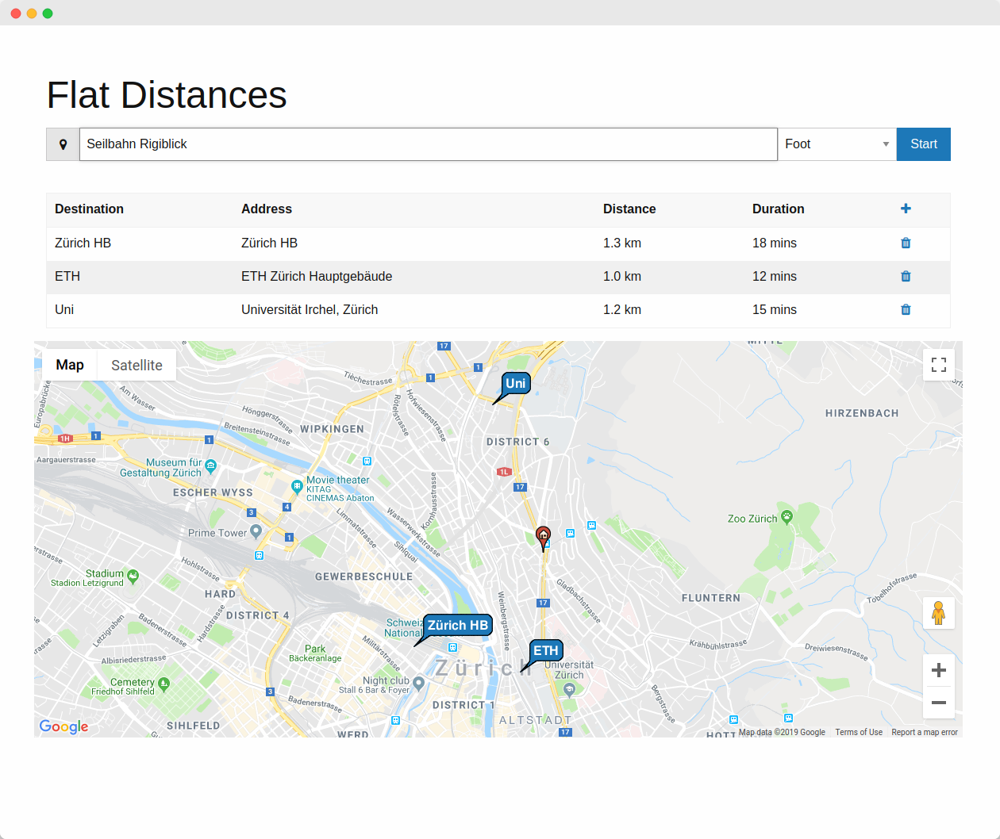

# FlatDist
Calculate the distances from your flat to multiple destinations.

  

## Getting Started
1. Aquire your own [Google Cloud Platform API Key](https://console.cloud.google.com)
2. Restrict the key to your domain / IP address (in case it ends up in a Git repository)
3. Replace the Google Maps API key in `index.html` with your own (in the Google JS API script include)

## Acknowledgements
The following projects or libraries helped to build FlatDist:
* [Google Maps API](https://developers.google.com/maps/)
* [MindMup/editable-table](https://github.com/mindmup/editable-table)
* [ZURB Foundation](https://foundation.zurb.com/)
* [jQuery](https://jquery.com/)
